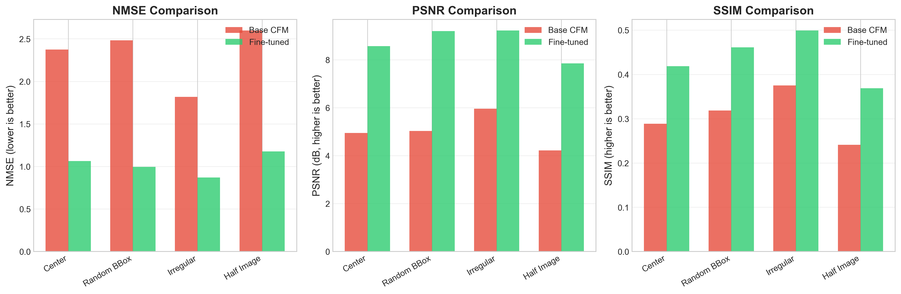
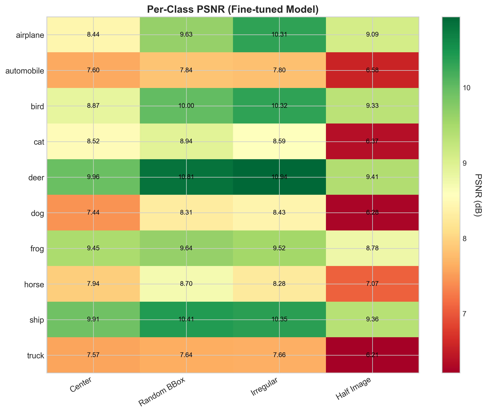
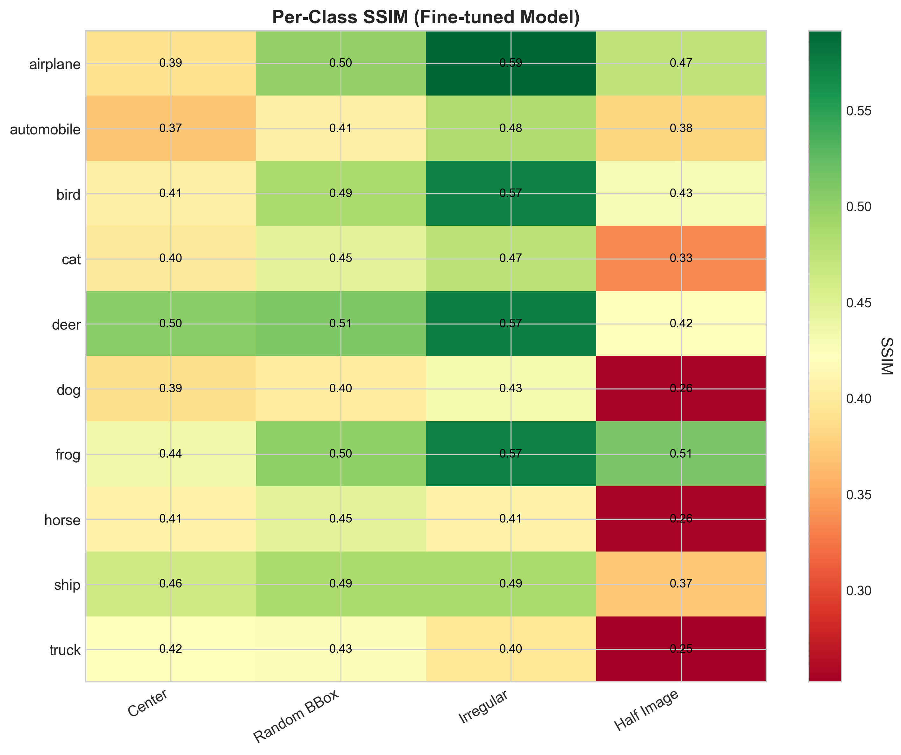
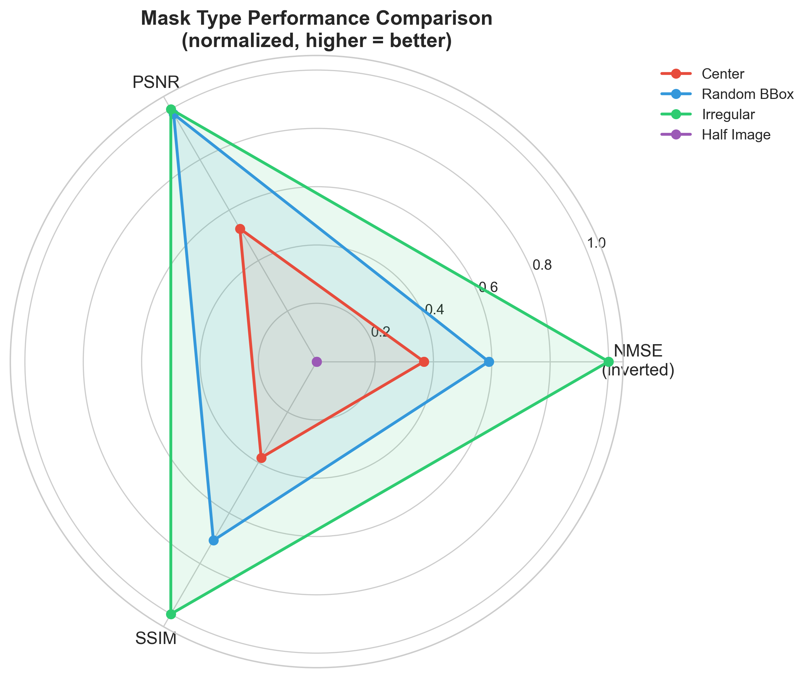
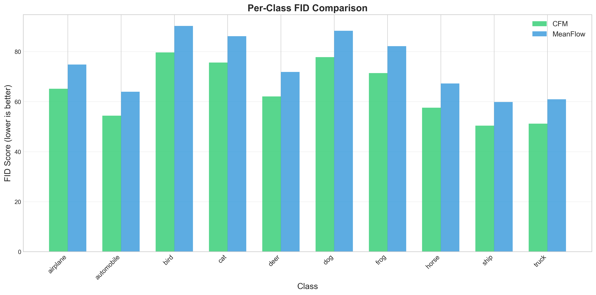

# From Diffusion to One-Step Generation: Flow Matching on CIFAR-10

[](https://www.python.org/downloads/)
[](https://pytorch.org/)
[](https://opensource.org/licenses/MIT)

arXiv link to be updated upon confirmation of submission, in the meantime, report is available at report.pdf

A comprehensive comparison of three generative modeling paradigms—**DDPM**, **Conditional Flow Matching (CFM)**, and **MeanFlow**—with an extension to **image inpainting**. This project demonstrates that flow-based methods significantly outperform traditional diffusion, and that MeanFlow enables **50× faster inference** through one-step generation.

<p align="center">
  
</p>

##  Key Results

| Method | FID ↓ | KID×1000 ↓ | NFE | Speed |
|--------|-------|------------|-----|-------|
| **CFM** | **24.15** | **12.39** | 50 | 28.0 img/s |
| **MeanFlow** | 29.15 | 13.52 | **1** | 25.7 img/s |
| DDPM | 402.98 | 463.21 | 50 | 27.4 img/s |

**Inpainting Improvement (after fine-tuning):**
- PSNR: +74% average improvement
- SSIM: +43% average improvement
- NMSE: -56% average reduction

---

##  Generated Samples

### CFM Generated Images (50 steps, CFG=3.0)

Our best-performing model generates high-quality class-conditional images:

<p align="center">
<table>
<tr>
<td align="center"><br><b>Airplane</b></td>
<td align="center"><br><b>Automobile</b></td>
<td align="center"><br><b>Bird</b></td>
<td align="center"><br><b>Cat</b></td>
<td align="center"><br><b>Deer</b></td>
</tr>
<tr>
<td align="center"><br><b>Dog</b></td>
<td align="center"><br><b>Frog</b></td>
<td align="center"><br><b>Horse</b></td>
<td align="center"><br><b>Ship</b></td>
<td align="center"><br><b>Truck</b></td>
</tr>
</table>
</p>

### MeanFlow Generated Images (1 step only!)

MeanFlow achieves comparable quality with **50× fewer function evaluations**:

<p align="center">
<table>
<tr>
<td align="center"><br><b>Airplane</b></td>
<td align="center"><br><b>Automobile</b></td>
<td align="center"><br><b>Bird</b></td>
<td align="center"><br><b>Cat</b></td>
</tr>
<tr>
<td align="center"><br><b>Deer</b></td>
<td align="center"><br><b>Dog</b></td>
<td align="center"><br><b>Frog</b></td>
<td align="center"><br><b>Horse</b></td>
</tr>
<tr>
<td align="center"><br><b>Ship</b></td>
<td align="center"><br><b>Truck</b></td>
<td align="center" colspan="2"><i>Single forward pass generation!</i></td>
</tr>
</table>
</p>

### DDPM Results (Training Failure)

DDPM with our TinyUNet architecture fails to converge, even after 400 epochs:

<p align="center">

<br><i>DDPM samples at epoch 399 — model fails to learn meaningful representations</i>
</p>

This explains the poor FID of 402.98. The failure is likely due to:
- Insufficient timesteps (T=200 vs typical T=1000)
- Architecture too small for noise prediction
- Velocity matching (CFM) is easier to learn than noise prediction (DDPM)

---

##  Inpainting Results

### Visual Comparison: Base Model vs Fine-tuned

Fine-tuning dramatically improves inpainting quality. Each row shows: **Original → Masked → Base Model → Fine-tuned Model**

#### Center Mask (16×16 square, 25% coverage)
<p align="center">

</p>

#### Random Bounding Box (variable size rectangles)
<p align="center">

</p>

#### Irregular Brush Strokes (scattered patterns)
<p align="center">

</p>

#### Half Image (50% coverage - hardest case)
<p align="center">

</p>

### Quantitative Improvement

<p align="center">

</p>

| Mask Type | NMSE (Base→FT) | PSNR (Base→FT) | SSIM (Base→FT) |
|-----------|----------------|----------------|----------------|
| Center | 2.37 → 1.06 (-55%) | 4.9 → 8.6 dB (+73%) | 0.29 → 0.42 (+45%) |
| Random BBox | 2.48 → 1.00 (-60%) | 5.0 → 9.2 dB (+83%) | 0.32 → 0.46 (+45%) |
| Irregular | 1.82 → 0.87 (-52%) | 6.0 → 9.2 dB (+55%) | 0.38 → 0.50 (+33%) |
| Half Image | 2.60 → 1.18 (-55%) | 4.2 → 7.8 dB (+86%) | 0.24 → 0.37 (+53%) |

### Per-Class Inpainting Performance

<p align="center">
<table>
<tr>
<td><br><b>PSNR by Class & Mask Type</b></td>
<td><br><b>SSIM by Class & Mask Type</b></td>
</tr>
</table>
</p>

**Best performing classes:** Deer, Ship, Frog (simpler textures)  
**Most challenging classes:** Dog, Truck, Cat (complex details)

### Mask Difficulty Analysis

<p align="center">

<br><i>Normalized performance across mask types (higher = better)</i>
</p>

---

##  Project Structure

```
aml_flow_matching_project/
├── models/
│   ├── unet.py                 # TinyUNet for CFM/DDPM
│   └── unet_mean.py            # TinyUNetMeanFlow (dual time inputs)
├── trainers/
│   ├── cfm_trainer.py          # CFM training with rectified flow
│   ├── ddpm_trainer.py         # DDPM training with cosine schedule
│   └── mean_trainer.py         # MeanFlow training with JVP
├── inpainting/
│   ├── cfm_inpainting.py       # Inpainting sampling algorithms
│   ├── finetune_inpainting.py  # Inpainting-aware fine-tuning
│   ├── evaluate_inpainting.py  # Evaluation metrics (NMSE, PSNR, SSIM)
│   └── demo_inpainting.py      # Demo script for inpainting
├── scripts/
│   ├── train_cfm.py            # Train CFM model
│   ├── train_ddpm.py           # Train DDPM model
│   ├── train_meanflow.py       # Train MeanFlow model
│   ├── evaluate.py             # Compute FID/KID metrics
│   └── generate_samples.py     # Generate and visualize samples
├── outputs/                    # Checkpoints and results
├── figures/                    # Generated figures for paper
└── requirements.txt
```

---

##  Quick Start

### Installation

```bash
# Clone the repository
git clone https://github.com/AgarwalUmang/aml_flow_matching_project.git
cd aml_flow_matching_project

# Create virtual environment
python -m venv venv
source venv/bin/activate  # Linux/Mac
# or: venv\Scripts\activate  # Windows

# Install dependencies
pip install -r requirements.txt
```

### Requirements

```txt
torch>=2.0.0
torchvision>=0.15.0
numpy>=1.21.0
matplotlib>=3.5.0
tqdm>=4.64.0
pillow>=9.0.0
scipy>=1.9.0
scikit-image>=0.19.0
pytorch-fid>=0.3.0
clean-fid>=0.1.35
```

---

##  Training

### 1. Train CFM (Conditional Flow Matching)

```bash
python scripts/train_cfm.py \
    --epochs 200 \
    --batch_size 128 \
    --lr 3e-4 \
    --cfg_dropout 0.1 \
    --output_dir outputs/cfm
```

**Key hyperparameters:**
- Learning rate: 3×10⁻⁴ with cosine annealing
- CFG dropout: 10% (drop class labels randomly)
- Optimizer: AdamW with weight decay 0.01

### 2. Train DDPM

```bash
python scripts/train_ddpm.py \
    --epochs 400 \
    --batch_size 128 \
    --lr 3e-4 \
    --timesteps 200 \
    --output_dir outputs/ddpm
```

**Note:** DDPM requires more epochs and may still underperform due to the noise prediction objective.

### 3. Train MeanFlow

```bash
python scripts/train_meanflow.py \
    --epochs 200 \
    --batch_size 128 \
    --lr 3e-4 \
    --output_dir outputs/meanflow
```

**Key difference:** MeanFlow uses dual time inputs (r, t) and JVP-based training.

---

##  Generation

### Generate Samples

```bash
# CFM generation (50 steps)
python scripts/generate_samples.py \
    --model cfm \
    --checkpoint outputs/cfm/best_model.pt \
    --num_samples 64 \
    --steps 50 \
    --cfg_scale 3.0 \
    --output_dir samples/cfm

# MeanFlow generation (1 step!)
python scripts/generate_samples.py \
    --model meanflow \
    --checkpoint outputs/meanflow/best_model.pt \
    --num_samples 64 \
    --steps 1 \
    --cfg_scale 2.0 \
    --output_dir samples/meanflow
```

### Evaluate FID/KID

```bash
python scripts/evaluate.py \
    --model cfm \
    --checkpoint outputs/cfm/best_model.pt \
    --num_samples 5000 \
    --steps 50 \
    --output results/cfm_evaluation.json
```

---

##  Image Inpainting

### Mask Types

We support four mask types:

| Mask Type | Description | Coverage |
|-----------|-------------|----------|
| `center` | 16×16 square in center | 25% |
| `random_bbox` | Random rectangles (8-20px) | Variable |
| `irregular` | 3-8 brush strokes | ~15-30% |
| `half` | Remove left/right/top/bottom half | 50% |

### Run Inpainting Demo

```bash
python inpainting/demo_inpainting.py \
    --checkpoint outputs/cfm/best_model.pt \
    --mask_type center \
    --num_samples 8 \
    --steps 50 \
    --cfg_scale 3.0 \
    --output_dir samples/inpainting
```

### Fine-tune for Inpainting

```bash
python inpainting/finetune_inpainting.py \
    --pretrained outputs/cfm/best_model.pt \
    --epochs 20 \
    --lr 5e-5 \
    --mask_prob 0.5 \
    --cfg_dropout 0.15 \
    --output_dir outputs/cfm_inpainting
```

**Fine-tuning strategy:**
- Start from pre-trained CFM checkpoint
- Use lower learning rate (5×10⁻⁵)
- 50% of batches use masked training
- Combined loss: 0.7×full + 0.3×masked region

### Evaluate Inpainting

```bash
python inpainting/evaluate_inpainting.py \
    --checkpoint outputs/cfm_inpainting/best_model.pt \
    --mask_type all \
    --num_samples 5000 \
    --output results/inpainting_evaluation.json
```

---

##  Method Overview

### Conditional Flow Matching (CFM)

CFM learns a velocity field that transports noise to data via straight paths:

```
Interpolation: x_t = (1-t)·x_0 + t·x_1,  where x_0 ~ N(0,I), x_1 ~ data
Target velocity: v = x_1 - x_0
Loss: ||v_θ(x_t, t, y) - v||²
```

**Sampling (Euler method):**
```python
z = torch.randn(batch, 3, 32, 32)  # Start from noise
for i in range(num_steps):
    t = i / num_steps
    v = model(z, t, class_label)
    z = z + (1/num_steps) * v
return z
```

### MeanFlow

MeanFlow models the *average* velocity over an interval, enabling one-step generation:

```
Average velocity: u(z, r, t) ≈ (1/(t-r)) ∫_r^t v(z_s, s) ds
One-step sampling: x = ε - u_θ(ε, 0, 1, y)
```

**Training uses the MeanFlow identity with JVP:**
```python
# Compute JVP for MeanFlow training
u_pred = model(z, r, t, y)
jvp_z = torch.autograd.functional.jvp(
    lambda z: model(z, r, t, y), z, u_pred
)[1]
jvp_t = torch.autograd.grad(u_pred, t, grad_outputs=torch.ones_like(u_pred))[0]
u_target = v_t - (t - r) * (jvp_z + jvp_t)
```

### CFM Inpainting

Mask-guided sampling constrains known regions during generation:

```python
def inpaint(image, mask, model, steps=50):
    # mask: 1 = known, 0 = to inpaint
    z = mask * image + (1 - mask) * torch.randn_like(image)
    
    for i in range(steps):
        t = i / steps
        v = model(z, t, class_label)  # With CFG
        z = z + (1/steps) * v
        z = mask * image + (1 - mask) * z  # Replace known regions
    
    return z
```

---

##  Generation Metrics

### Overall Performance

<p align="center">
  
</p>

### Per-Class FID Analysis

<p align="center">
  
</p>

| Class | CFM FID | MeanFlow FID | Difficulty |
|-------|---------|--------------|------------|
| Ship | **50.38** | **59.83** | Easy |
| Truck | 51.18 | 60.94 | Easy |
| Automobile | 54.37 | 63.94 | Easy |
| Horse | 57.58 | 67.24 | Medium |
| Deer | 62.06 | 71.89 | Medium |
| Airplane | 65.13 | 74.85 | Medium |
| Frog | 71.41 | 82.16 | Medium |
| Cat | 75.63 | 86.18 | Hard |
| Dog | 77.77 | 88.32 | Hard |
| Bird | **79.66** | **90.23** | Hard |

---

##  Model Architecture

### TinyUNet (~1.4M parameters)

```python
TinyUNet(
    in_channels=3,
    base_channels=64,
    channel_mults=[1, 2, 4],      # 64 → 128 → 256
    num_res_blocks=2,
    time_embed_dim=128,
    num_classes=10,
    dropout=0.1
)
```

**Architecture details:**
- Time embedding: Sinusoidal + MLP
- Class embedding: Learned embeddings (dim=128)
- Residual blocks with GroupNorm
- Self-attention at 8×8 resolution
- Skip connections for U-Net structure

### TinyUNetMeanFlow

Same architecture but with **dual time inputs** (r, t):
```python
# MeanFlow requires both interval endpoints
time_embed = self.time_mlp(sinusoidal_embed(r)) + self.time_mlp(sinusoidal_embed(t))
```

---

##  Configuration Files

### Training Config Example

```yaml
# config/cfm_training.yaml
model:
  type: cfm
  base_channels: 64
  channel_mults: [1, 2, 4]
  num_res_blocks: 2

training:
  epochs: 200
  batch_size: 128
  lr: 3e-4
  weight_decay: 0.01
  cfg_dropout: 0.1
  
scheduler:
  type: cosine
  min_lr: 1e-4

sampling:
  steps: 50
  cfg_scale: 3.0
```

---

##  Reproducing Results

### Full Training Pipeline

```bash
# 1. Train all three models
bash scripts/train_all.sh

# 2. Evaluate generation
python scripts/evaluate.py --model cfm --checkpoint outputs/cfm/best_model.pt
python scripts/evaluate.py --model meanflow --checkpoint outputs/meanflow/best_model.pt
python scripts/evaluate.py --model ddpm --checkpoint outputs/ddpm/best_model.pt

# 3. Fine-tune CFM for inpainting
python inpainting/finetune_inpainting.py --pretrained outputs/cfm/best_model.pt

# 4. Evaluate inpainting
python inpainting/evaluate_inpainting.py --checkpoint outputs/cfm_inpainting/best_model.pt

# 5. Generate visualizations
python scripts/visualize_all_results.py
```

### Expected Training Time (RTX 3090)

| Model | Epochs | Time/Epoch | Total |
|-------|--------|------------|-------|
| CFM | 200 | ~48s | ~2.7h |
| MeanFlow | 200 | ~55s | ~3.1h |
| DDPM | 400 | ~45s | ~5.0h |
| Inpainting FT | 20 | ~50s | ~17min |

---

##  References

```bibtex
@article{lipman2023flow,
  title={Flow Matching for Generative Modeling},
  author={Lipman, Yaron and Chen, Ricky TQ and Ben-Hamu, Heli and Nickel, Maximilian and Le, Matt},
  journal={ICLR},
  year={2023}
}

@article{liu2023flow,
  title={Flow Straight and Fast: Learning to Generate and Transfer Data with Rectified Flow},
  author={Liu, Xingchao and Gong, Chengyue and Liu, Qiang},
  journal={ICLR},
  year={2023}
}

@article{meanflow2025,
  title={MeanFlow: One-Step Generation via Mean Velocity},
  author={...},
  journal={arXiv},
  year={2025}
}

@article{ho2020denoising,
  title={Denoising Diffusion Probabilistic Models},
  author={Ho, Jonathan and Jain, Ajay and Abbeel, Pieter},
  journal={NeurIPS},
  year={2020}
}
```

---

##  License

This project is licensed under the MIT License - see the [LICENSE](LICENSE) file for details.

---

##  Contributing

Contributions are welcome! Please feel free to submit a Pull Request.

1. Fork the repository
2. Create your feature branch (`git checkout -b feature/AmazingFeature`)
3. Commit your changes (`git commit -m 'Add some AmazingFeature'`)
4. Push to the branch (`git push origin feature/AmazingFeature`)
5. Open a Pull Request

---

##  Contact

- **Author:** Umang Agarwal
- **Project Link:** [https://github.com/AgarwalUmang/aml_flow_matching_project](https://github.com/AgarwalUmang/aml_flow_matching_project)

---

<!-- <p align="center">
  <b>⭐ If you find this project useful, please consider giving it a star! ⭐</b>
</p> -->
